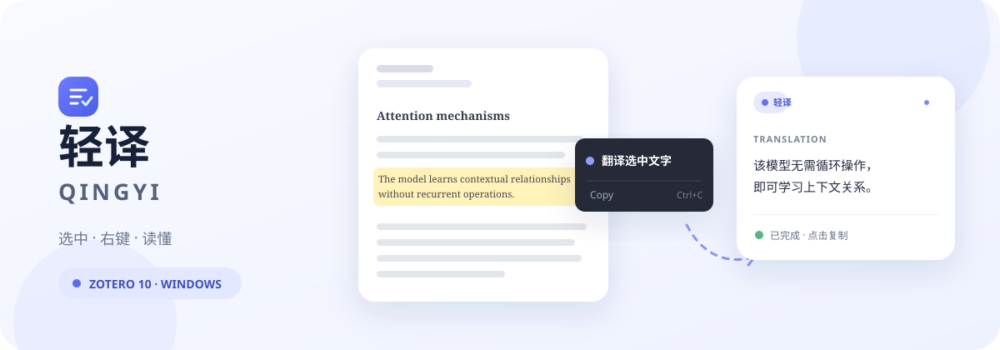
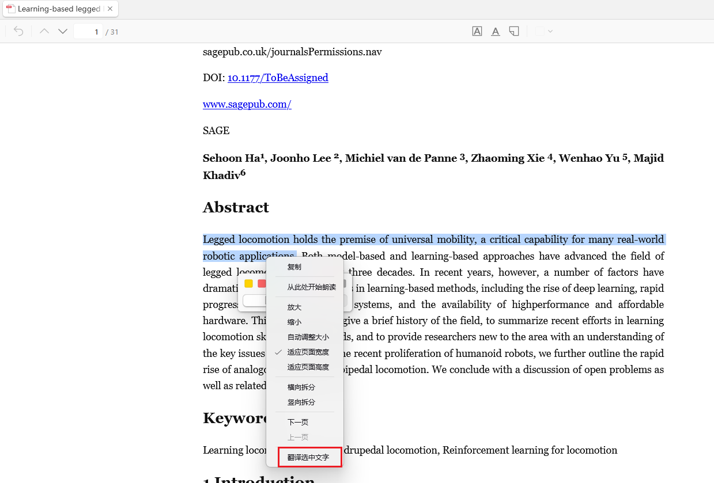
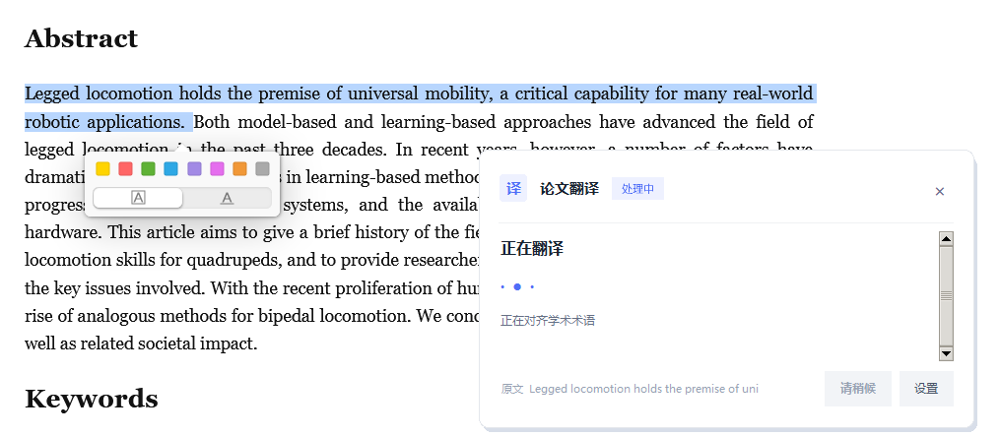
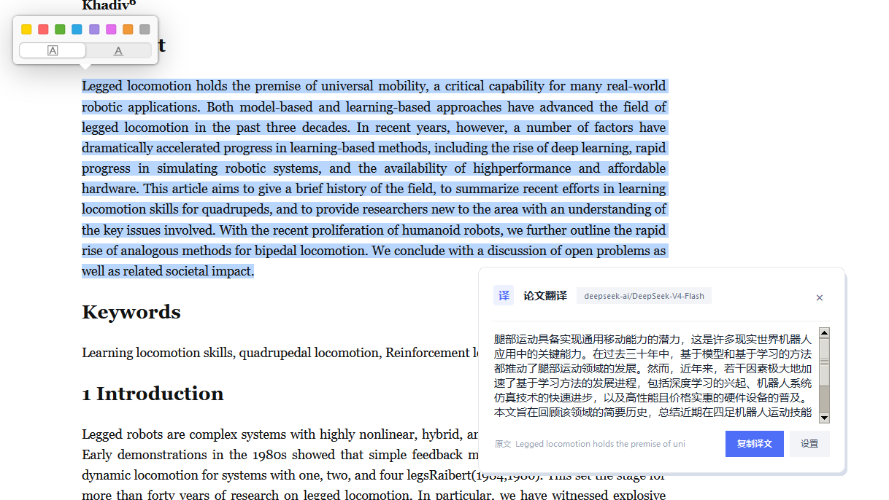
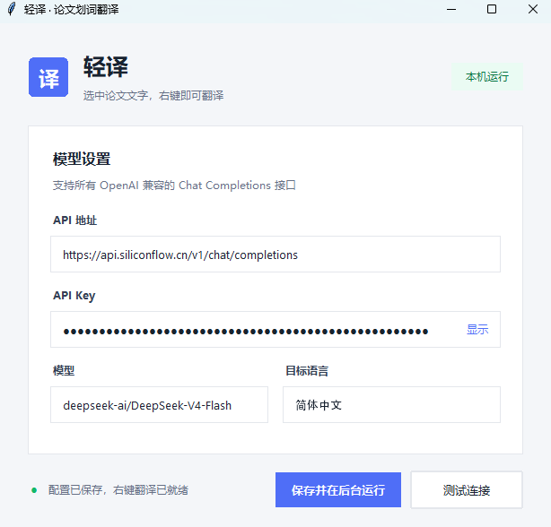
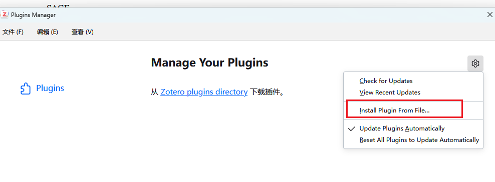
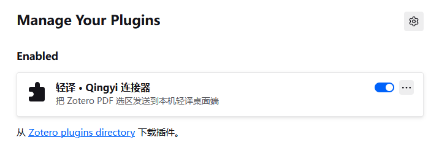

<p align="center">
  
</p>

<p align="center">
  <strong>Select. Right-click. Understand.</strong><br>
  A lightweight LLM-powered selection translator for Windows and Zotero 10.
</p>

<p align="center">
  <a href="README.md">简体中文</a> · English
</p>

<p align="center">
  <a href="https://github.com/ruali-dev/qingyi-translator/actions/workflows/ci.yml"></a>
  <a href="LICENSE"></a>
  <a href="https://github.com/ruali-dev/qingyi-translator/releases"></a>
</p>

# Qingyi（轻译）

Qingyi keeps paper translation inside the reading flow: select text in a Zotero PDF, right-click `翻译选中文字` (“Translate selected text”), and a result card appears immediately. It shows an animated loading state while the request is running and an in-place red error bubble when something fails.

Requests go to the OpenAI-compatible endpoint you configure. The desktop process and Zotero connector stay deliberately small—no resident browser and no full web framework.

The motivation is simple: get the selection-translation flow of a full dictionary app without installing one just to read papers, while keeping control over the model and provider.

> Status: early preview for Windows and Zotero 10.0.x. Complete the [release checklist](docs/release-checklist.md) before publishing the first GitHub Release.

## See it in action

These are screenshots from Qingyi running inside the Zotero 10 reading flow—not conceptual mockups.

**1 — Select paper text and choose `翻译选中文字` from the native context menu**

<p align="center">
  
</p>

**2 — The translation window appears immediately with a clear processing state**

<p align="center">
  
</p>

**3 — Read or copy the result without leaving the paper**

<p align="center">
  
</p>

## Highlights

- **Native right-click action** inside the Zotero PDF reader.
- **Immediate feedback** with a lightweight card and animated loading state.
- **Visible failures** for timeouts, authentication errors, and network issues.
- **Bring your own endpoint**: OpenAI, DeepSeek, Moonshot, Qwen-compatible services, Ollama, and other `/chat/completions` APIs.
- **Protected local secrets** using Windows DPAPI for the API key.
- **Small resident footprint** built with Python/Tk, Win32 tray APIs, and a thin Zotero connector.
- **Fallback hotkey**: `Ctrl+Shift+T` works with selected text in other readers.

## Getting started

### 1. Run the desktop app

Download `Qingyi.exe` from [GitHub Releases](https://github.com/ruali-dev/qingyi-translator/releases/latest). On first launch, enter:

- API base URL, such as `https://api.openai.com/v1`
- API key
- Model, such as `gpt-4.1-mini`
- Target language; Simplified Chinese is the default

Choose `保存并隐藏` (“Save and hide”) to keep Qingyi in the system tray.

<p align="center">
  
</p>

### 2. Install the Zotero connector

1. Open “Tools → Plugins” in Zotero.
2. Open the gear menu and choose “Install Plugin From File…”.
3. Select `qingyi-zotero.xpi` from the Release assets.
4. Open a PDF, select text, and right-click `翻译选中文字` (“Translate selected text”).

Keep the desktop app running. Zotero shows a clear message when it cannot reach Qingyi.

<p align="center">
  
</p>

Confirm that the “轻译 · Qingyi 连接器” entry is enabled:

<p align="center">
  
</p>

### 3. Configure an API

| Provider | Example base URL | Example model |
| --- | --- | --- |
| OpenAI | `https://api.openai.com/v1` | `gpt-4.1-mini` |
| DeepSeek | `https://api.deepseek.com` | `deepseek-chat` |
| Ollama | `http://127.0.0.1:11434/v1` | Any locally installed model |

Qingyi appends `/chat/completions` when needed. A complete endpoint URL also works.

## Run from source

Requirements: Windows, Python 3.11+, and Zotero 10.0.x.

```powershell
py -3 -m venv .venv
.\.venv\Scripts\Activate.ps1
py -3 -m pip install -r requirements-dev.txt
py -3 app.py
```

Test and build:

```powershell
py -3 -m pytest
py -3 scripts/build.py
```

Build outputs are written to `dist/`:

- `Qingyi.exe`
- `qingyi-zotero.xpi`

## Repository layout

```text
paper_translator/   Windows app, translation client, local service, and UI
zotero-connector/   Native Zotero 10 context-menu connector
scripts/            One-command packaging script
tests/              Config, API, local server, and XPI metadata tests
assets/readme/      GitHub README artwork and product screenshots
docs/               Release and maintenance notes
```

The Zotero connector caches the current Reader selection and sends it to the desktop app on `127.0.0.1:8765`. The desktop app owns status UI and LLM requests; the API key never passes through the connector.

## Privacy and security

- Only selected text is sent to the configured LLM provider.
- The API key is protected with Windows DPAPI. Settings remain in `%APPDATA%\PaperTranslator\config.json`; the legacy directory name is retained for compatibility.
- The local server binds only to `127.0.0.1`, is not exposed to the LAN, and caps JSON requests at 64 KiB.
- Review your provider's data policy before translating sensitive or unpublished material.

## Known limitations

- Windows only for now.
- The native connector currently targets Zotero 10.0.x.
- Other PDF readers use the fallback hotkey because a standalone app cannot inject their native context menus.
- Scanned PDFs need OCR before text can be selected.

## Contributing

Issues, interaction ideas, and provider compatibility improvements are welcome. Read [CONTRIBUTING.md](CONTRIBUTING.md) before making changes; release history lives in [CHANGELOG.md](CHANGELOG.md).

If Qingyi makes paper reading a little smoother, consider starring the repository.

## License

Qingyi is open source under the [Apache License 2.0](LICENSE). You may use, modify, and distribute the project under its terms.
